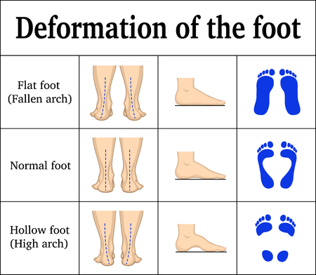

# stepsafe
A footstep monitor that diagnoses overpronation and supination. 

Both flat foot (*overpronation*) and hollow foot (*supination*) are formed when footsteps occur at an irregular angle. By using a three-axis accelerometer, we can determine the angle at which footsteps occur to prevent the deformation of the foot. 
